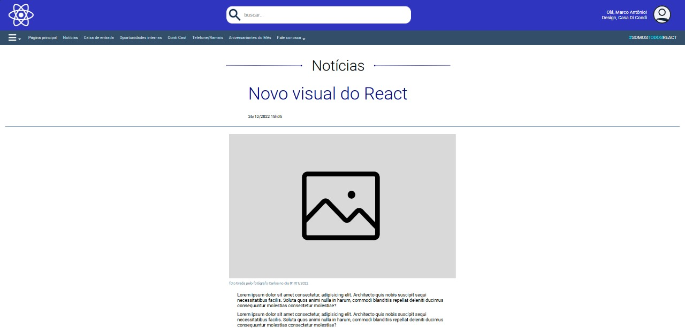
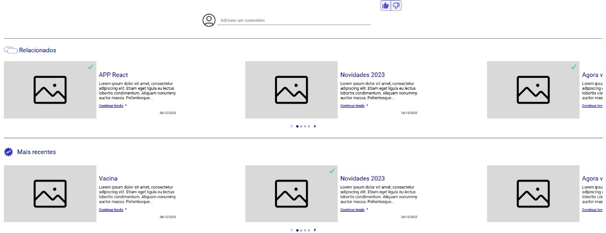

# 🌐 Homepage Digital

Este é um projeto de Homepage Digital desenvolvido com ReactJS e TypeScript, utilizando Styled-components para o estilo. A aplicação apresenta um layout responsivo, com foco na exibição de notícias e conteúdos.

## 🎯 Objetivo

Este projeto tem como objetivo demonstrar a construção de uma homepage digital responsiva em React, focando na organização de conteúdo, navegação intuitiva e interação do usuário, utilizando bibliotecas e ferramentas modernas do ecossistema React.

Acesse o Projeto Completo aqui: 

__________________________________________________________________________________________________________

# Guia de Estilo do Front-end

## 🎨 Layout

O design é responsivo, adaptando-se a diferentes larguras de tela. As alterações de layout significativas ocorrem em pontos de quebra para:

- 📱 Mobile: Larguras menores ou iguais a 968px (para o cabeçalho) e 748px, 768px, 1024px (para os carrosséis).
- 🖥️ Desktop: Larguras maiores que 968px (para o cabeçalho) e 1280px (para os carrosséis).

## 🌈 Cores

O projeto utiliza uma paleta de cores definida por variáveis CSS para uma identidade visual consistente

--header-background: #3035BF (azul escuro)
--color-text-header: #D9E2EC (cinza claro/quase branco)
--nav-background: #334E68 (azul-acinzentado escuro)
--color-title-body: #000480 (azul escuro)
--input-text-darkgray: #829AB1 (cinza escuro para inputs)
--input-text-gray: #BCCCDC (cinza médio para inputs)
--color-text-body: #243B53 (azul-acinzentado escuro)
--color-date: #102A43 (azul muito escuro)
--color-description-image: #627D98 (azul-acinzentado)
#00E6FE (azul ciano)
#4C51D9 (azul médio para botões de reação)
#9FB3C8 (azul-acinzentado claro para bullets e controles desabilitados)

## ✒️ Tipografia

A fonte principal utilizada em toda a aplicação é Roboto. Os tamanhos de fonte variam para criar uma hierarquia visual

- Subtítulo (Novo visual do React): 60px (diminui para 40px em 840px e 30px em 480px)
- Título do Guia (Notícias): 51px (diminui para 30px em 840px)
- Títulos dos Cartões (APP React, Vacina): 24px
- Títulos de Seção (Relacionados, Mais recentes): 24px
- Texto do Input (buscar...): 18px
- Texto do Corpo/Descrição do Cartão: 16px
- Links de Navegação (Página principal, Notícias): 14px
- Data do Conteúdo Principal (26/12/2022 15h05): 14px
- Link "Continue lendo" do Cartão: 14px
- Data do Cartão (20/12/2022): 12px
- Descrição da Foto: 12px

## 🚀 Funcionalidades

- Cabeçalho Dinâmico: Adapta-se à largura da tela, exibindo diferentes layouts para mobile e desktop.
- Barra de Pesquisa: Funcionalidade de busca integrada no cabeçalho.
- Perfil de Usuário: Exibe informações do usuário no cabeçalho.
- Menu Hambúrguer: Menu de navegação para mobile que expande uma sidebar com links.
- Navegação Principal: Links para seções importantes como Página principal, Notícias, Caixa de entrada, Oportunidades internas, Conti Cast, Telefone/Ramais, Aniversariantes do Mês e Fale conosco.
- Conteúdo em Destaque: Exibição de uma notícia principal com imagem, descrição detalhada, botões de reação (curtir/não curtir) e área para comentários.
- Carrosséis de Conteúdo: Duas seções de carrossel (SwiperSection) para "Relacionados" e "Mais recentes", cada uma exibindo múltiplos cartões de conteúdo (Card).
- Controles de Carrossel: Navegação entre os slides dos carrosséis com botões de seta e bullets de paginação.
- Indicador de Visualização: Ícone de "check" em cartões já visualizados.

## 🛠️ Tecnologias Utilizadas

- [React](https://react.dev/)
- TypeScript
- [Styled-components](https://styled-components.com/)
- [Swiper](https://swiperjs.com/)
- [React Icons](https://react-icons.github.io/react-icons/)

## 💡 Aprendizados

Durante o desenvolvimento deste projeto, foram praticados e aplicados conceitos como

- Criação de componentes funcionais em React e tipagem com TypeScript.
- Uso de useState e useEffect para gerenciamento de estado e efeitos colaterais.
- Estilização de componentes com styled-components, incluindo media queries para responsividade.
- Implementação de carrosséis interativos com Swiper.js e seus módulos.
- Manipulação de eventos e lógica condicional para interatividade da UI (e.g., botões de like/dislike, menu hambúrguer).
- Estruturação de dados mock para simulação de conteúdo (e.g., relatedContent, latestContent).

## ▶️ Como executar

1. Clone o repositório: git clone https://github.com/chris-valentim/Homepage-Digital.git
2. Navegue até o diretório do projeto: cd Homepage-Digital
3. Instale as dependências: npm install

## 🚀 Primeiros Passos com Create React App

Este projeto foi inicializado com [Create React App.](https://github.com/facebook/create-react-app)

### 📦 Scripts Disponíveis

No diretório do projeto, você pode executar os seguintes comandos:

### ▶️ npm start

Inicia a aplicação em modo de desenvolvimento.
Abra http://localhost:3000 no navegador para visualizar.

A página será recarregada automaticamente ao fazer alterações no código.
Possíveis erros de lint também serão exibidos no console.

### ✅ npm test

Executa o test runner em modo interativo de observação.
Veja mais na seção sobre [execução de testes.](https://create-react-app.dev/docs/running-tests/)

### 🛠️ npm run build

Cria uma versão otimizada para produção na pasta build.

O React será empacotado corretamente no modo de produção.
O build será minificado e os arquivos conterão hashes nos nomes para melhor performance.
Sua aplicação estará pronta para ser implantada.

Veja mais na seção sobre [deployment.](https://create-react-app.dev/docs/deployment/)

### ⚠️ npm run eject

Atenção: essa ação é irreversível! Uma vez que você usar eject, não é possível voltar atrás!

Caso não esteja satisfeito com as configurações do build, você pode executar o eject.
Isso moverá todas as dependências e arquivos de configuração (Webpack, Babel, ESLint, etc.) para dentro do seu projeto.

Todos os comandos continuarão funcionando, mas agora você terá controle total sobre cada configuração.
Você não precisa usar o eject — os recursos fornecidos já são suficientes para a maioria dos projetos pequenos e médios.
